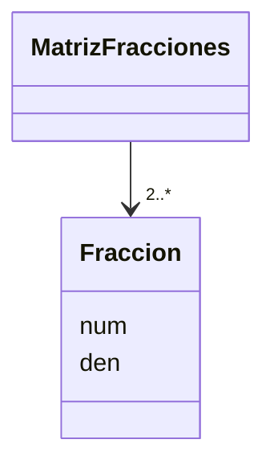

# Ejercicio - Fracciones / Matrices de Fracciones

## Descripción del Problema

Esta actividad consiste en resolver la **Evaluación Diagnóstica** de tu UF TC1030 y someterla a revisión con **Autograding**.

## Ejemplo de ejecución
```
Creando fracciones:
5/7
3/8
Su suma es:
61/56
Su multiplicación es:
15/56
Leyendo archivos de matrices (m1.f, m2.f y m3.f)...
Sumando m1+m2:
3x4
1/4 2/5 1/3 3/7 
1/2 3/5 7/8 1/9 
0/1 1/3 2/3 5/6 
+
3x4
1/2 3/5 6/7 1/5 
3/4 0/1 3/8 2/7 
2/9 1/3 1/3 1/3 
=
3x4
3/4 1/1 25/21 22/35 
5/4 3/5 5/4 25/63 
2/9 2/3 1/1 7/6 
Comparando m1 contra m2 (son iguales/diferentes)...
m1 es diferente a m2 
Matriz m3=
3x4
3/4 1/1 25/21 22/35 
5/4 3/5 5/4 25/63 
2/9 2/3 1/1 7/6 
Comparando m1+m2 contra m3 para verificar que la suma es (correcta/incorrecta)...
Suma correcta 
```

## Diagrama de Clases


[Diagramas de clase en el lenguaje Mermaid](https://mermaid.js.org/syntax/classDiagram.html)

## Prompt para generar el Diagrama de Clases con IA - mermAID

1. Da clic en la herramienta  `mermAId`.
2. En la ventana `mermAId` da clic en `Continue in Chat`.
3. Coloca como contexto el/los `<archivo.cpp/hpp>`(s) a crearles su Diagrama de clases UML.
4. Usa el siguiente *prompt*:
```
@mermaid /uml
```
## Diagrama de clases UML con draw.io

El repositorio está configurado para crear Diagramas de clases UML con ```draw.io```. Para usarlo simplemente das doble clic en el archivo  ```uml.class.drawio.png``` y se activará el editor ```draw.io``` incrustado en ```VSCode``` para edición. Asegúrate de agregar las formas UML en el menú de formas del lado izquierdo (opción ```+Más formas```). Al final insertas el archivo ```uml.class.drawio.png``` en apartado de UML de este archivo README.

Para más información consulta el [MarketPlace](https://marketplace.visualstudio.com/items?itemName=hediet.vscode-drawio).

## Prompt para revisar la aplicación de estándares de codificación y sugerir mejoras con IA

1. Abre la ventana `Copilot Edit`/`Ediciones de Copilot`.
2. Coloca como contexto el/los `<archivo.cpp/hpp>`(s) a verificar la aplicación de estándares de programación. 
3. Usa el siguiente *prompt*:

```
Revisa la aplicación de estándares de codificación y sugiere posibles mejoras para cumplir con ellos
```
4. Verifica los cambios sugeridos y aprueba aquéllos que consideres convenientes.

## Objetivo

- Busca que el código pase correctamente todas las pruebas
   * Solamente cambia los archivos permitidos para lograr este objetivo (abajo se indican las reglas específicas)
   
- Las GitHub Actions deberán presentar una palomita en verde si se han satisfecho todas las pruebas, y una cruz roja cuando alguna (o todas) las pruebas han fallado.
   * **Recomendación:** Puedes dar clic en la cruz roja para verificar cual de las pruebas ha fallado (o si el código no ha compilado correctamente).
   * **Recomendación:** En caso de que el Autograding no muestre pruebas o no funcione, contacta a tu profesor mediante un issue.

## Instrucciones

- Deberás modificar el archivo `exercise.cpp`  y agregar la programación adicional que sea necesaria.

Explicación de los otros archivos:

- Archivo `test/tests.cpp` tiene las pruebas de esta actividad (NO LO CAMBIES!)
- Archivo `makefile` tienes los comandos para ejecutar la actividad (NO LO CAMBIES!)
- Archivo  `./build/appTests` se generará después de compilar (para **pruebas locales**, solo ejecútalo)

## Comandos para pruebas locales, ejecución y depuración

- Comando para construir y ejecutar pruebas: `make` o `make test` o `make ctest`
    * Si el ejecutable ya está construido, sólo teclea : `./build/appTests`

- Comando para construir y ejecutar la aplicación: `make run` 
    * Si el ejecutable ya está construido, sólo teclea : `./build/exercise`
      
- Comando para depurar: `make debug`
    * Para conocer los comandos de depuración consulta:
     https://u.osu.edu/cstutorials/2018/09/28/how-to-debug-c-program-using-gdb-in-6-simple-steps/

- Comando para depurar con `vsCode`: `make debugvs` 
    * Abre el programa principal.
    * Utiliza el depurador de la IDE.
      
- Comando para depurar pruebas con `vsCode`: `make debugtest` 
    * Abre el programa principal.
    * Utilizar el depurador de la IDE.
- Comando para limpieza de binarios `make clean`
    * Úselo cuando desee eliminar cualquier binario que se haya generado en la carpeta `build`.
    * Úselo cuando detecte que algún binario no está actualizado o bien no se hubiere construido conrrectamente.

## Instrucciones para construir y ejecutar la aplicación y pruebas usando CMake

1. Entrar al directorio de construcción:
   ```sh
   cd build
   ```

2. Configurar el proyecto con CMake:
   ```sh
   cmake -DTEST_EXECUTABLE=ON ..
   cmake -DMAIN_EXECUTABLE=ON ..
   ```

3. Construir la aplicación:
   ```sh
   cmake --build .
   ```

4. Ejecutar la aplicación:
   ```sh
   ./exercise
   cd ..
   ```
5. Ejecutar las pruebas:
   ```sh
   ./appTests
   cd ..
   ```
## Notas

- El código será evaluado solamente si compila.
   * La razón de esto es, si no compila no es posible generar el ejecutable y realizar las pruebas.

- Algunos casos de prueba podrían recibir calificación individual, otros podrían recibir calificación y si pasan todos juntos (o todas las pruebas en conjunto).

- La calificación final se otorgará de manera automática en cada *commit*, y se evaluará solamente hasta la fecha limite de la actividad.

Para dudas adicionales, consulta a tu profesor.

## License

MIT License 2020
